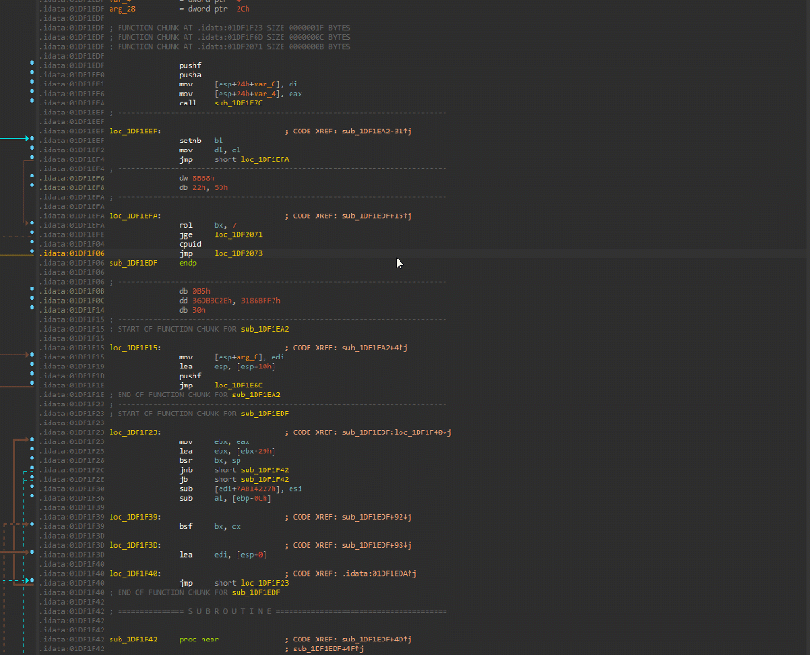

# ShowComments

IDA Pro plugin that shows comments in a database

## Installation

Copy `showcomments.py` to `plugins` folder under IDA Pro installation path or IDA Pro user path.

# Usage

Select an `IDA View` tab in IDA and go to `Edit->Plugins->ShowComments` or just press `Ctrl`+`Alt`+`C`.

## Features

- Support for regular and repeatable comments.
- Double click an address to follow it in IDA View.
- Click the table headers to sort.

## FAQ

1. How can I only show the user added comments?

I found no way in IDA to find only this type of comments. A workaround is to always set repeatable comments and use ShowComments to sort by them.

2. Does it recognize function comments?

Yes.

3. What IDA versions are supported?

I've tested it with 9.1 and 9.2, but it is possible it works with other versions too.
